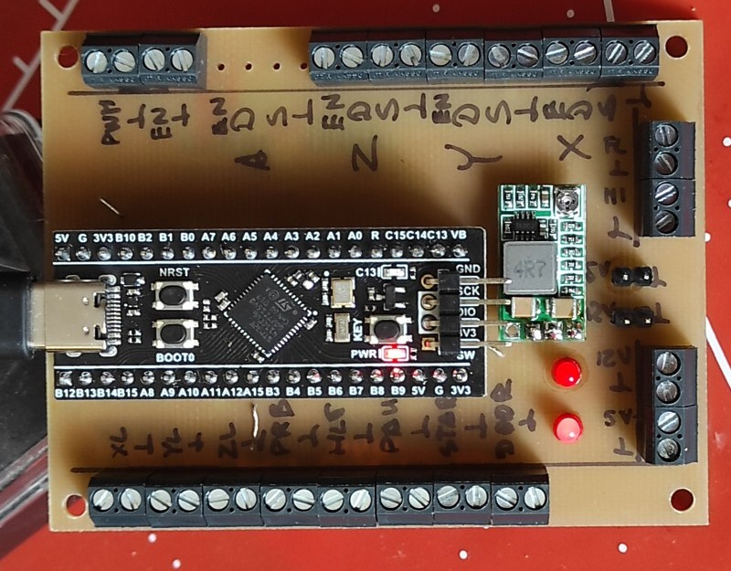

# grblHAL
STM32F401 GRBL Controller over BlackPill board.

Schematic and layout are completed. Screw Terminal Connectors and optos are aligned. Added 4 TMC2208. 

### Inspired from <a href="https://github.com/avizienis/Minimal-Black-Pill--STM32F4xx-BOB-for-grblHAL">Minimal-Black-Pill--STM32F4xx-BOB-for-grblHAL</a> 
 

### Our Kicad design below. 

 
 
